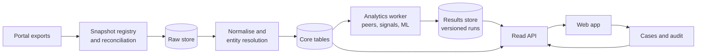
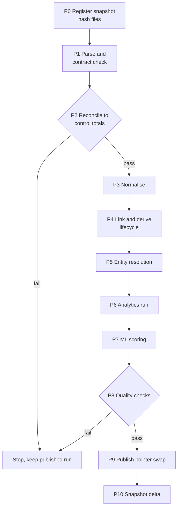
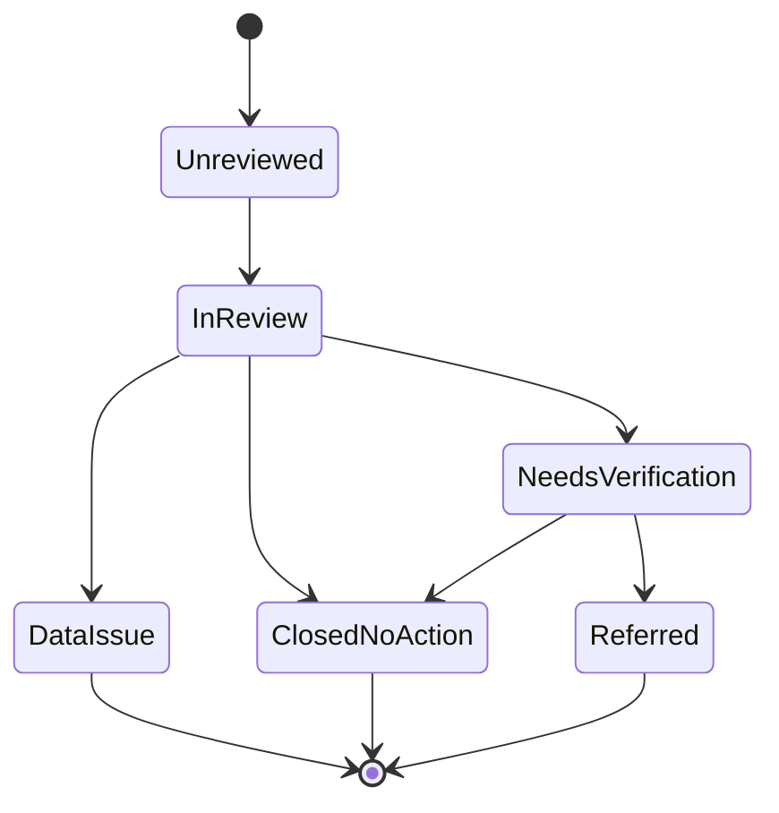

# Sentinel 2.0 — Final Architecture Blueprint

As of 2026-09-20 · SIH 2026 · Problem statement SIH26102 · Team CivicLens

## 1. Purpose, scope and principles

Sentinel 2.0 is an explainable prioritisation and monitoring platform for MPLADS works, built only on data the team actually holds; it ranks works and entities for human review and never states that anything is fraudulent.

It answers SIH26102 (MoSPI, Data Informatics & Innovation Division): detect anomalies, inefficiencies and non-compliance in MPLADS implementation and support decisions by MPs, State Nodal Authorities, District Authorities and the Ministry. Tens of thousands of works cannot all be examined in depth, so Sentinel decides where to look first.

### PS requirements and where Sentinel answers them

| PS requirement | Sentinel module | Status on the data we hold |
| --- | --- | --- |
| Cost anomalies in sanctions | Cost signal against peer baselines | Feasible: sanction and actual amounts, official work type, state and FY peers |
| Expenditure patterns, fund utilisation | Utilisation funnel, payment analytics, fund-flow forecast | Feasible: allocations, recommended, sanctioned and paid amounts |
| Payments | Per-work payment ledger, ageing, payee analytics | Feasible: payments join to works by key |
| Duplicate works | Near-duplicate signal | Feasible from descriptions, MP and district authority; no coordinates exist |
| Delayed projects | Lifecycle delay signal, one-year completion check | Feasible: real sanction and completion dates |
| Cost overruns | Integrity check only | **Not detectable**: actual never exceeds sanction in 43,842 completed works |
| Non-compliance | Deterministic compliance panel | Partial: date and amount integrity, one-year norm, entitlement limits |
| Predictive insights, early warning | Survival model, delay early-warning, fund-flow forecast | Feasible: completion is an observable outcome |
| Dashboards for four stakeholder groups | Role-scoped views | Feasible |
| Trend analysis | Financial-year trends inside the 18th Lok Sabha, macro reference for 2014-2020 | Partial: no work-level history before 2023 |
| Asset creation | None | Not covered beyond an image flag in Snapshot B |

### Principles

1. **Prioritise, never accuse.** Outputs say "unusual pattern, verification suggested", never "fraud".
2. **Only data we hold.** Real and derived fields are labelled; no synthetic records are mixed in; unsupported PS items are stated as not covered.
3. **Explainable by construction.** Every score decomposes into signals, each showing baseline, observed value and peer count.
4. **Risk and confidence are separate.** Risk is how anomalous a work looks; confidence is how reliable the evidence and context are. Confidence is never the probability of wrongdoing.
5. **Base evidence is counted once.** Derived corroboration is never counted again as a separate signal.
6. **No silent policy changes.** The v3 weights (25/20/10/10/10/10/15) and tiers (40/65/85) carry over as provisional; they change only through the gates in sections 6, 12 and 13.
7. **Rules and statistics stay apart.** Compliance checks are deterministic and reported separately from statistical risk.
8. **Reproducible.** Every result names its snapshot, run and engine version.
9. **Humans decide.** Investigators can override any tier with a reason; the trail is append-only.
10. **Gemini never scores.** It only answers help questions grounded in stored results.

### Vocabulary

- **Snapshot A:** portal grid exports, data through 30 August 2026 (recommended, sanctioned, completed, expenditure, allocation, roster, calamity).
- **Snapshot B:** dashboard exports dated 19 September 2026 (recommended, completed, expenditure, MP summary).
- **Work:** one row per `WORK_RECOMMENDATION_DTL_ID`. **IDA:** the district authority. **Stage owner:** the party responsible for a lifecycle step (MP recommends, district sanctions, agency executes and pays).

## 2. Data foundation

The platform rests on two official portal snapshots that reconcile exactly to the portal's own control totals; everything else in this blueprint is limited by what these files can and cannot show. Team statement: retrieved from official government portals. Record the portal address, retrieval dates and method in each snapshot's provenance card.

### Sources and roles

| Source | Content | Role |
| --- | --- | --- |
| Snapshot A: works recommended (LS) | 103,330 Lok Sabha works, with sanction date and amount | Core |
| Snapshot A: works sanctioned (LS / RS) | 78,232 / 19,274 | Core |
| Snapshot A: works completed (LS / RS) | 33,955 / 9,887 | Core |
| Snapshot A: expenditure (LS / RS) | 82,885 / 24,941 payments (107,826), payee ID, implementing agency, work key | Core |
| Snapshot A: allocation, MP roster, states, calamity | 774 MPs (543 LS, 231 RS); 778 roster IDs; 34 calamity rows | Core reference |
| Snapshot B: four dashboard exports | Later state (19 Sep 2026); image flags; MP summary; 6,055 Rajya Sabha works pending sanction absent from A | Second snapshot, delta and gap-fill |
| Prior-cycle backlog (semicolon file) | 60,359 works recommended Apr 2023 to Mar 2024, with block and village, no key | Descriptive table only |
| Parliamentary answers (3 files) | State and national totals, FY2014-15 to 2019-20 | Macro reference only |
| Old `mplads_ready.csv` | 64,058 rows, one per work-stage, subset of A | Retired; regression fixture only |

### Control totals (Snapshot A, all reconcile exactly)

| File | Portal total (INR crore) |
| --- | --- |
| Recommended (LS) | 5,638.66 |
| Sanctioned LS / RS | 4,117.67 / 1,693.24 |
| Completed LS / RS | 1,632.00 / 755.42 |
| Payments LS / RS | 2,736.15 / 1,232.93 (total 3,969.08) |
| Allocation LS / RS | 8,318.06 / 3,363.85 |

### Verified facts the design relies on

- `WORK_RECOMMENDATION_DTL_ID` is unique across both Houses. Every completed work has a sanction record; every payment matches a sanctioned work.
- Work type is official and parseable: `ACTIVITY_NAME` in work files is a code prefix plus the type text. Parsing gives 115 types (112 in payments); the parsed type equals the payment type for all 70,963 works with payments. The top 10 types cover 71.2% of works.
- Recommendation to sanction: median 78 days (p90 233). Sanction to completion: median 153 days (p90 384); 11.9% of completed works took over a year.
- 53,664 sanctioned works are not completed; 13,562 (25.3%) are more than a year past sanction, 542 more than two.
- Payments: median 1 per work; 1.9% of works with payments have four or more payees; 2.5% of payment rows repeat exactly within a work (1,754 extra copies, INR 30.8 crore).
- Payee IDs are stable (no ID has two spellings); 1,045 names are shared by more than one ID.

### Hard limits

1. **18th Lok Sabha and sitting Rajya Sabha only**, despite "alltenures" in file names. No 16th or 17th Lok Sabha work-level data.
2. **Cost overruns cannot exist in this data**: actual is at most sanction (86.5% exactly equal), payments never exceed sanction, none precede sanction.
3. **`WORK_STAGE` is stale** (87% of completed works still read "Physical Inspection"). Lifecycle is derived from file membership and dates.
4. **Ratings are 0 for 43,838 of 43,842 completed works**; file-attachment fields are blank for 27-76% of rows. Neither is a compliance signal.
5. **No coordinates.** Location exists only in descriptions and in the prior-cycle backlog file.
6. **Rajya Sabha recommended file is missing** from Snapshot A; fill from Snapshot B or obtain it.
7. **Snapshots are 19 days apart**: 278 more completions and 869 more payments (+INR 26.3 crore) in B. Two points are not yet a history.

### Corrections to earlier notes

- Work type does not need a classifier: it is parseable (this supersedes the earlier statement that categories were unusable).
- The old CSV's 68% "duplicates" were mostly the same work listed at several stages, not templated descriptions.

## 3. System architecture

Sentinel 2.0 separates computing from serving: a batch worker builds versioned results into PostgreSQL, and a stateless API only reads them. This fixes the old prototype's 24-second startup recompute, its in-memory state, and its file-based audit trail.



Read left to right: ingestion never touches results, the worker never serves requests, and the API never computes scores.

### Components

| Component | Responsibility | Notes |
| --- | --- | --- |
| Ingest and registry | Register snapshot, hash files, separate footer rows, reconcile to control totals | Fails closed: a mismatch stops the run |
| Normaliser | Types, dates (DD-Mon-YYYY), parsed work type, district from IDA, name forms | Deterministic, no network |
| Entity resolution | Payees by ID, agency typing, MP roster join, state crosswalk | Fuzzy matches go to a review queue |
| Analytics worker | Peer baselines, signals, fusion, confidence, compliance, entity metrics, ML jobs | One run = one immutable set of results |
| Read API | Paginated, role-scoped, response-modelled (Pydantic v2) | Reads the published run only |
| Web app | Dashboards, dossier, map, cases | React 18, Vite, plain CSS kept |
| Copilot | Help answers grounded in stored results | Never produces scores |

### Deployment

Docker Compose with four services: API, worker, PostgreSQL and a static web server. A persistent host is required; a serverless-only deployment cannot hold a long batch run or durable case data. Secrets come from the environment; nothing sensitive is committed.

### Technology decisions

| Layer | Choice | Reason |
| --- | --- | --- |
| API | FastAPI, Pydantic v2 | Already in use; add response models |
| Data | PostgreSQL 16 with `pg_trgm`, `jsonb` | Constraints, concurrent case writes, text search |
| Access | SQLAlchemy 2, Alembic, psycopg 3 | Typed access and migrations |
| Compute | pandas, numpy, scikit-learn | Already in use; 130k works is small |
| Survival | lifelines | Kaplan-Meier, Cox, accelerated failure time |
| Entity matching | rapidfuzz | Light dependency |
| Data contracts | pandera | Schema checks at ingest |
| Tests | pytest, hypothesis | Property tests catch alignment and ordering bugs |
| Frontend | React 18, Vite, Leaflet, Recharts, plain CSS | No fashionable rewrite |

SQLite in WAL mode is acceptable for a local demo if the schema stays portable, but PostgreSQL is the default.

### Explicitly not adopted

Graph databases, Kafka, Spark, Celery or Redis (until a measured need appears), microservices, deep learning, GNNs, image models, TypeScript or Tailwind migrations.

## 4. Database schema

The schema keeps raw data immutable, normalised data keyed by the portal's work key, and every derived result tied to a snapshot, run and engine version. Six schema groups follow; a table listed here is a design commitment, columns are indicative.

### Ingest and provenance

| Table | Grain and key | Notes |
| --- | --- | --- |
| `source_snapshot` | One per import; id | Portal address, retrieval date and method, file hashes, imported_by, status |
| `raw_file` | One per file per snapshot | Name, SHA-256, byte size, footer total stored separately |
| `raw_row` | (raw_file, row_no) | Insert-only text values; nothing edited in place |
| `control_total` | (snapshot, file, measure) | Portal value, computed value, pass or fail |
| `import_reject` | (raw_file, row_no) | Reason code for any row not loaded |

### Reference and identity

| Table | Grain and key | Notes |
| --- | --- | --- |
| `state`, `state_alias` | State id; alias per historical name | Crosswalk for names in old parliamentary tables (A & N Island, D & N Haveli, Daman & Diu, J&K) |
| `district_authority` | IDA name; district key parsed from the name | 763-769 authorities |
| `implementing_agency` | IA name; type | About 7,200 agencies; typed by rules and review |
| `payee` | Portal vendor ID | Canonical name, type (private firm, statutory or government body, manufacturer, individual), review status |
| `payee_alias` | (payee, name) | Names shared across IDs are kept, never merged silently |
| `activity_type` | Parsed official type text | About 115 types; taxonomy version |
| `person` | Roster ID | Name, state, house; from the 778-row MP roster |
| `tenure` | (person, tenure label) | 18th Lok Sabha, sitting Rajya Sabha or nominated; start and end dates from allocation; constituency nullable for Rajya Sabha |
| `constituency` | Constituency id | Period-scoped; name alone is never a key |

### Core (per snapshot)

| Table | Grain and key | Notes |
| --- | --- | --- |
| `work` | `work_key` = portal `WORK_RECOMMENDATION_DTL_ID` | House, tenure, IDA, activity type, description raw and normalised, first-seen snapshot |
| `work_state` | (work, snapshot) | Recommended and sanctioned amounts and dates, completion flag, actual amount and date, raw portal stage (kept, not trusted), flag, file status |
| `payment` | (snapshot, work, payee, agency, date, amount, occurrence_no) | Status stored per snapshot; identical rows keep an occurrence number, never dropped |
| `allocation` | (tenure, snapshot) | Allocated amount |
| `calamity_consent` | Row per consent | Small descriptive table |
| `prior_cycle_work` | Row per backlog work | Village, block, city, ward; no key; separate from `work` |
| `macro_reference` | (state or national, FY, measure) | Value, source document, question number, as-of date |

### Analytics (append-only, keyed by run)

| Table | Grain and key | Notes |
| --- | --- | --- |
| `analysis_run` | Run id | Snapshot, engine version, config hash, git SHA, seed, output hash, status |
| `published_run` | Single row pointer | Which run the API serves |
| `peer_group`, `work_context` | (run, level, key); (run, work) | Level used, `n_usable` excluding self, distinct-MP count, median, scale |
| `signal_result` | (run, work, signal) | Score, tail percentile, direction, `is_base`, eligibility flag, evidence jsonb |
| `risk_result` | (run, work) | Risk, tier, confidence, base signal count, corroboration factor, config name |
| `compliance_result` | (run, work, check) | Pass or fail, values |
| `entity_metric` | (run, entity type, entity, metric) | Value, n, interval; payee, agency, IDA, tenure |
| `tenure_profile` | (run, tenure) | Report payload jsonb, coverage indicators |
| `forecast_result` | (run, work or tenure, model) | Predicted values with intervals |
| `model_version` | Model id | Algorithm, feature-spec hash, training snapshot, metrics, artifact hash |

### Workflow

| Table | Notes |
| --- | --- |
| `app_user`, `role`, `user_scope` | Roles plus state or district scope |
| `alert` | Type, work or entity, stage owner, severity, status, run |
| `case`, `case_event` (append-only), `case_note` | Actor comes from the auth token; optional hash chain across events |
| `disposition_code` | Controlled vocabulary with no "fraud confirmed" value |
| `audit_sample`, `audit_review` | Randomised, tier-stratified review sample and results |

### Rules that keep it reproducible

- **Work identity:** the portal key, unique across both Houses. Assign to a tenure, not directly to a person.
- **No in-place edits:** a corrected import creates a new snapshot.
- **Snapshots are never merged:** each reconciles to its own control totals.
- **Payments across snapshots:** matched on (work, payee, agency, date, amount, occurrence_no); status is an attribute that may change.
- **Same inputs, config and seed must reproduce the same output hash.**

### Indexes and constraints

`work(tenure)`, `work(ida)`, `work_state(snapshot, work)`, `payment(work)`, `payment(payee)`, `payment(snapshot, date)`, `risk_result(run, tier, risk DESC)`, `signal_result(run, work)`, trigram GIN on normalised description, exclusion constraint on overlapping tenures per person, foreign keys throughout, and a check that a work's constituency matches its tenure.

## 5. Pipelines

Every run follows one fixed sequence with a hard gate after each stage; a failed gate stops the run and leaves the previously published results untouched.



The diamonds are the two places where a run can be rejected before anything reaches users.

### Stage specification

| Stage | What it does | Gate |
| --- | --- | --- |
| P0 Register | Store files as received; record source, retrieval date, method, SHA-256 | Provenance card complete |
| P1 Parse and contract | Split footer rows; handle the semicolon file; check types, DD-Mon-YYYY dates, non-negative amounts, required columns | Contract violations are rejected with reason codes |
| P2 Reconcile | Compare each file's body sum to its footer total; compare counts to Snapshot B control values where the date allows | Any file failing stops the run |
| P3 Normalise | Parse work type from the activity string; district key from the IDA name; normalise names; map state aliases | Parse rate reported (100% for type and district in Snapshot A) |
| P4 Link and derive | Join recommended, sanctioned, completed and payments on the work key; derive lifecycle status from file membership and dates; keep the raw portal stage but never use it | Referential checks (361 sanctioned works absent from the recommended file are logged, not hidden) |
| P5 Entity resolution | Payees by portal ID; typing rules; agency typing; roster join by normalised name (100% matched in Snapshot A) | Unmatched names go to a review queue |
| P6 Analytics | Peer baselines, six base signals, corroboration, fusion, confidence, compliance checks, entity metrics, tenure profiles | Property tests on a fixture must pass in CI, and run-level sanity ranges must hold |
| P7 ML scoring | Apply registered models to the run: survival, early-warning, forecasts, text similarity | Model version and calibration checks |
| P8 Quality checks | Tier distribution within expected range, no null scores for eligible works, output hash recorded | Out-of-range distributions block publishing |
| P9 Publish | Atomic swap of `published_run`; cache keys change by run id | None; swap is a single statement |
| P10 Delta | Compare with the previous snapshot: new completions, new sanctions, payment increments, status changes | Feeds alerts and trend views |

### Operating rules

- **Idempotent:** re-running a stage on the same snapshot and config gives the same output hash.
- **Cadence:** import every new export; archive snapshots regularly (at least weekly once permitted) because transitions and payment lifecycles can only be learned from repeated snapshots. Check the portal's terms of use before automating any retrieval; until then, imports are manual.
- **Model training:** separate weekly job, never inside the scoring run.
- **Runtime target:** a full run over about 130,000 works and 108,000 payments in minutes on a laptop-class machine. This is a target to verify, not a measured figure (the old prototype took about 24 seconds for 64,000 rows).
- **Failure behaviour:** users always see the last good published run, labelled with its snapshot date.

## 6. Signals and risk engine

The engine keeps the v3 architecture (context, peers, base signals, corroboration, risk plus confidence) and the v3 weights and tiers as provisional, while correcting implementation defects and separating decisions that need evidence into gated candidates. The 0-100 risk score means "how anomalous does this work look"; the confidence score means "how reliable is the evidence".

### Corrections versus gated policy changes

| Kind | Item | Status |
| --- | --- | --- |
| Correction (aligns code with the stated definitions) | Peer baseline excludes the work itself; usable peer count excludes missing amounts; each score attaches to its own row by key, never by position; anomaly scores contain no confidence terms; confidence contains no anomaly evidence; base and derived signal counts are kept separate everywhere | Built in from the start |
| Gated policy change | Weights, tier thresholds, "active" threshold, pattern signal as additive versus multiplier only, one-sided versus two-sided cost distance, calibration of signals to tail probabilities | Two configurations run side by side until gate G3 (section 13) |

### Peer hierarchy (measured coverage on Snapshot A)

More specific peers are not automatically better here: district-level groups mostly contain a single MP's works, so they measure within-MP consistency rather than what is normal.

| Level | Peer key | Rule | Coverage |
| --- | --- | --- | --- |
| 1 | Work type, state, sanction FY | At least 15 usable peers excluding self, at least 3 distinct other MPs, no MP above 50% of the group | 92.7% of works have 10 or more peers; 90.5% have 3 or more MPs |
| 2 | Work type, state (all FYs) | Same rule | 96.8% have 10 or more peers |
| 3 | Work type, national, sanction FY | Same rule | 99.5% have 10 or more peers |
| Refinement | Work type, district, FY | Used only when the group has 3 or more MPs and 15 or more peers | Only 19.1% of works qualify; district comparison lives in section 8 |

Every result stores the level used, `n_usable`, distinct-MP count and the group's scale, so the dossier can show the actual peer distribution.

### Cost baseline method

Compute robust location and scale on log amount, with the scale floored because amounts are discrete (45.3% are multiples of INR 50,000; 9.9% are exactly INR 5,00,000) and dispersion within a work type is wide (median coefficient of variation 1.16). The distance is a robust z on the log scale, mapped to a 0-1 score by a documented monotone function; direction (above or below peers) is always stored and shown. A round figure at the peer mode is not itself unusual. Because size drivers such as road length are not in the data, cost anomaly is a prioritisation cue with wide bands, and confidence reflects the dispersion.

### Signal catalogue

| Signal | Provisional weight | Definition on the new data | Change from v3 |
| --- | --- | --- | --- |
| Cost anomaly | 25% | Sanction amount (open works) or actual amount (completed) against level-1 peers | Peer reliability removed from the score; leave-one-out; cross-MP requirement |
| Near-duplicate work | 20% | Same district authority and MP or type; character n-gram TF-IDF cosine on normalised descriptions with location tokens; amount and date proximity; national phrase-frequency discount | One row per work, so multi-stage rows cannot look like duplicates; tuned on hand-labelled pairs |
| Portfolio concentration | 10% | An MP's share of a work type within their own portfolio against peer MPs in the state (standardised residual, minimum portfolio size) | Replaces the count-over-mean ratio, which mostly measured volume |
| District-authority pattern | 10% | A district authority's type share and amount ratio against other authorities in the same state | Replaces the constituency-name grouping (Rajya Sabha members have no constituency) |
| Temporal anomaly | 10% | Bursts of recommendations or sanctions per MP and authority against their normal cadence, after removing national batch days (for example 594 completions on one day in Snapshot B) | Batch-aware; fixes the dead MP-quarter branch |
| Lifecycle delay | 10% | Age since sanction against the peer completion distribution (exceedance probability); payment share ahead of completion against peers | Replaces stage-consistency, which compared stage sets across different works |
| Corroboration (derived) | 15% | Function of the count and strength of active base signals; never a seventh independent signal | Two configurations, see below |

Recommendation-to-sanction lag is shown on each work but belongs to the district authority (section 8); it does not enter the MP-facing score.

### Fusion and corroboration

```latex
R = 100 \cdot \min\big(1,\; m(k)\cdot \sum_{i \in B} w_i \, s_i \big)
```

`B` is the set of base signals, `s_i` the signal scores, `w_i` the weights, `k` the number of active base signals, and `m(k)` the v3 corroboration multiplier table, retained unchanged as provisional. Two configurations run in parallel:

- **v3-compatible:** the 15% pattern component stays additive as in v3, with the multiplier retained.
- **v4-candidate:** corroboration acts as the multiplier only; base weights are renormalised. It counts base information once.

The choice is made at gate G3 from the ablation and sensitivity results; until then the v3-compatible configuration is the default shown.

### Confidence

Confidence combines only data and context quality: peer reliability (usable peers, distinct MPs, level), dispersion, field completeness for the signals that could be evaluated, and data-quality flags (inconsistent `FLAG` values, missing description, referential gaps). A signal whose inputs are missing is recorded as "not evaluated", never as zero, and lowers confidence.

### Tiers

LOW 0-39, MODERATE 40-64, HIGH 65-84, CRITICAL 85-100, unchanged. CRITICAL also requires at least three active base signals, as in v3. A capacity view (top N per district or state) is added without changing any tier.

### Compliance and integrity panel (deterministic, outside the risk score)

| Check | Rule | Baseline on Snapshot A |
| --- | --- | --- |
| C1 | Actual amount is at most sanction | 0 violations in 43,842 completed works |
| C2 | Payments per work do not exceed sanction | 0 violations |
| C3 | No payment before sanction date | 0 rows |
| C4 | Recommendation, sanction, completion dates in order | 0 violations |
| C5 | Completion within one year of sanction (scheme guideline, verify current text) | 11.9% of completed works over; 13,562 open works past one year |
| C6 | Completed works have at least one payment | 100 works without |
| C7 | Recommended at most allocated; expenditure at most recommended | 0 violations (MP summary, Snapshot B) |
| C8 | Referential integrity | 361 sanctioned works absent from the recommended file; 499 rows with `FLAG` 2 lacking stage and sanction date |
| C9 | Reconciliation to portal totals | All nine files pass |

Most checks pass. That is a finding: the portal enforces amount and date constraints, and Sentinel should say so rather than manufacture violations.

## 7. ML layers

ML earns a place only where an outcome can be observed and validated: completion time, payment timing and text similarity have real ground truth; "fraud" does not, so no model is trained to predict it. There is no ML in the risk score at launch; ML outputs appear as evidence and forecasts until gate G6.

### Why not an unsupervised fraud-style detector

There are no fraud labels, and later investigator outcomes will be biased because only prioritised works are examined. Isolation Forest fixes the share flagged by its contamination setting, and local outlier factor degrades when many amounts are identical (28% of amounts here sit on shared round figures). A multivariate model would mostly rediscover large amounts and busy MPs, duplicating the cost signal.

### Layers

| ID | Layer | Type and target | Placement | Validation |
| --- | --- | --- | --- | --- |
| A1 | Completion-time model | Survival (Kaplan-Meier, Cox or accelerated failure time) on sanction-to-completion time; 43,842 observed completions plus 53,664 right-censored open works; real dates, no imputation | Feeds the lifecycle delay signal and forecasts | Out-of-time split; concordance index; calibration of predicted percentiles |
| A2 | Delay early-warning | Probability a sanctioned work is not complete within 365 days, from features known at day 90 and 180 | Alerts with an early-warning horizon | Out-of-time split; Brier score; calibration curve |
| A3 | Fund-flow forecast | Monthly payments and utilisation per MP and state, simple baselines against gradient boosting | Dashboards; year-end utilisation view | Rolling-origin backtest; error against seasonal-naive baseline |
| B1 | Near-duplicate text model | Character n-gram TF-IDF with blocking; embeddings only if error analysis shows n-grams miss real duplicates | Implementation of the duplicate signal | About 500 hand-labelled pairs; precision and recall by threshold |
| B2 | Payee resolution | Rules plus fuzzy matching over 27,961 names and 29,583 IDs; human review queue | Reference-data quality | Hand-labelled sample of about 300 pairs |
| B3 | Expected-cost model | Quantile regression or constrained gradient boosting of log amount on type, state, FY, district | Alternative baseline to the peer median, gated | Out-of-fold interval coverage against nominal |
| B4 | Multivariate atypicality | Robust Mahalanobis distance on a small interpretable feature vector, Isolation Forest as comparator | Evidence only, with per-feature contributions | Ablation and reviewer usefulness |

A work-type classifier is not needed: the official type is parsed from the data (section 2).

### Leakage and validity rules

1. Never use MP or payee identity as a feature in B3; it would absorb the very effect being tested.
2. Never use `risk_score` as a feature.
3. A2 uses only information available at the prediction day, including payments to that day.
4. Cross-validation groups by state or MP so templated works do not leak across folds.
5. No model is trained on later periods to score earlier ones.
6. The training data contains the anomalies; use robust or quantile losses.
7. Model outputs never include MP or vendor rankings.

### Governance

Every model is registered in `model_version` with its algorithm, feature specification hash, training snapshot, metrics and artifact hash. Seeds are fixed. Models retrain weekly in a separate job and are scored inside each run. Drift is watched through distribution shift on inputs and scores. Each model has a one-page model card stating its purpose, data, limits and failure modes.

### Entry into the risk score (gate G6)

A layer may become a base signal only after a pre-registered study shows it adds information beyond the rule and statistical engine, does not simply mirror an existing signal, and is confirmed useful by reviewers. It then enters with its own weight and independence checks, as a new configuration.

### Not built

Supervised fraud classifiers, deep learning, graph neural networks, image models, rating or sentiment models, and any LLM-generated score or explanation. Gemini stays a grounded help assistant.

## 8. Payee, agency and district analytics

Entity analytics describe patterns for payees, agencies and district authorities; they appear as profiles and as context tags on works, and they never add to a work's risk score. Guilt by association would contaminate every work a payee touched and double-count the cost signal.

### Why typing comes first

The payee field mixes private contractors, government bodies, manufacturers and statutory levies. In Snapshot A the payee with the most works (785) received INR 3.5 crore in total from a single MP, about INR 45,000 per work. Another payee has 425 works and INR 0.1 crore across 15 MPs and looks like a statutory levy, not a contractor. A naive concentration flag would misfire on both, so every payee carries a type and review status before any concentration metric is shown.

### Metrics

| Metric | Grain | Method | Use |
| --- | --- | --- | --- |
| Payee concentration | MP tenure, district authority | Herfindahl index and effective number of payees, compared with a permutation null that shuffles payees within district, work type and FY strata | Profile and evidence tag: "unusual given the local market" |
| Payee price position | Payee, work type | Median residual against level-1 peers with bootstrap interval and minimum work count | Profile; never inherited by works |
| Payee reach | Payee | Works, MPs, districts, amount; typed peers only | Descriptive |
| Repeated identical payments | Work | Identical (payee, amount, date) within a work; baseline 2.5% of rows, INR 30.8 crore | Evidence; not an accusation |
| Multi-payee works | Work | Four or more payees; baseline 1.9% of works with payments | Descriptive (often unit-wise purchases) |
| Payment ahead of completion | Work | Paid share of sanction against peers; 31.7% of open works have 90% or more paid, so it is baselined, not flagged raw | Lifecycle delay signal input |
| District authority profile | IDA | Recommendation-to-sanction lag, sanction-to-completion, open backlog age, payment ageing, against other authorities in the state | Owner-specific view |
| Implementing agency profile | Agency | Completion lag and price position for agencies with enough works | Descriptive with minimum n |

### Graph layer

A network view of MPs, works, payees and authorities is computed offline for exploration (for example, a payee spanning many districts). It is not a graph database and not a scoring component; community detection on this structure mostly recovers geography.

### Wording rules

- Say "unusual relative to peers", never "suspicious" or "linked to wrongdoing".
- Show the denominator, interval and peer definition beside every entity metric.
- Names of sole-proprietor payees receive the same care as any personal data; review handling before any public release.
- An unusual relationship is a pattern to inspect, not evidence of misconduct.

## 9. MP report

The MP report is a single-tenure portfolio profile with year-wise trends, not a ranking and not a score; a multi-Lok-Sabha version is designed for but blocked by data, because the files hold only the 18th Lok Sabha and the current Rajya Sabha terms.

### Entity and identity

The unit of estimation is the **tenure** (a person in a seat over a date range), and the person is the unit of display. Persons come from the MP roster (778 IDs); every allocation and work name matched the roster by normalised name in Snapshot A. Rajya Sabha members have no constituency, and nominated members are a separate tenure type. The tenure table already supports one person across several tenures and constituencies, so a future 16th or 17th Lok Sabha export can be added without redesign. Fuzzy name matches are queued for human review and never merged automatically: attributing another person's works is the worst error this report can make.

### Report sections

| Section | Content |
| --- | --- |
| Entitlement funnel | Allocated, recommended, sanctioned, completed, paid, using the portal's own definitions. "Utilisation" means recommended over allocated |
| Pace | Recommendation-to-sanction, sanction-to-completion and payment lag as distributions, with the owner of each step |
| Portfolio | Work type mix, amount distribution, description repetition within the tenure |
| Risk distribution | Tier shares with intervals, and which signals drive them, against expected variation |
| Payees | Typed payee concentration and reach with the caveats of section 8 |
| Trend | Financial-year series inside the tenure |
| Coverage | Works and rupees covered, fields present, share with usable peers, share with roster or tenure ambiguity |

### Metric rules

1. **Exposure:** normalise by allocation (INR 14.7 crore for 448 MPs, INR 4.9 crore for 51) and by months in office; raw counts are never compared.
2. **Rates with uncertainty:** Wilson intervals, with empirical-Bayes shrinkage toward the peer mean so a small portfolio does not look extreme.
3. **Expected versus observed:** standardise by work-type, state and FY mix and report an observed-to-expected ratio with an interval.
4. **Display:** funnel-style plots against expected variation, never an ordered league table, and no composite MP score.
5. **Minimum sizes:** below the minimum number of works a section shows "insufficient data".
6. **Peers:** MPs in the same House with similar allocation and tenure length.

### Stage-owner attribution

| Step | Owner | Shown in |
| --- | --- | --- |
| Recommendation | MP | MP report |
| Recommendation to sanction | District authority | Authority profile, shown but not attributed to the MP |
| Sanction to completion | Implementing agency and district authority | Authority and agency profiles |
| Payment | Agency and district authority | Payment analytics |

### What could mislead

- **Mid-term censoring:** the 18th Lok Sabha is about two years in, so completion rates of recent works are understated for everyone.
- **Batch dates:** portal-wide bulk updates distort date-based views; they are removed before burst tests.
- **Prior-cycle backlog:** 84% of the 60,359 works recommended in April 2023 to March 2024 were never sanctioned and lapsed with the tenure; they are not delays.
- **House differences:** Rajya Sabha and Lok Sabha portfolios differ in size and geography.
- **Risk mechanics:** risk scores are peer-relative, so MP-level differences partly reflect volume and batch recording; the report always decomposes by signal.
- **Multiple comparisons:** with hundreds of MPs, some will look extreme by chance; use interval and false-discovery controls.

### Language

The report says: "Compared with works of the same type in the same state and year, this tenure's share of high-priority works is X (interval) against Y expected." It never says an MP is risky.

### Later extension

With earlier work-level exports, movers (MPs who changed constituency) would allow a person-versus-place comparison: a pattern that follows the MP suggests the person or team; one that stays in the seat suggests the place. Power will be low, so it would be shown descriptively.

## 10. Alerts, roles and the investigator workspace

The platform serves four stakeholder groups from the same stored results, each seeing the steps it owns, and turns findings into a bounded number of routed alerts and auditable cases.

### Role views

| Role | Scope | Sees |
| --- | --- | --- |
| MP | Own tenure | Funnel, pace, portfolio, pending items; no other MP's data |
| District authority | Own district | Sanction backlog and age, delayed works, payment ageing, agency profiles |
| State nodal authority | Own state | District comparisons, state trends, macro reference, alerts by district |
| Ministry | National | Utilisation, completion and lag trends, compliance panel, capacity queue |
| Investigator and supervisor | Assigned scope | Full work dossier, cases, audit sample, override tools |

### Alert types

| Type | Trigger | Routed to | Horizon |
| --- | --- | --- | --- |
| Compliance | A deterministic check fails (for example C5, C6, C8) | Stage owner | Now |
| Risk tier | HIGH or CRITICAL with confidence above a floor | Investigator queue | Now |
| Early warning | A2 probability above a threshold for a sanctioned work | District authority | 90-180 days ahead |
| Payment ageing | In-progress payment older than a configured age (Snapshot B: 50.9% of in-progress payments were over 30 days old) | District authority | Now |
| Backlog | Sanctioned work past one year without completion | District authority and agency | Now |

Alert budgets stop overload: alerts are deduplicated per work, capped per queue, and ranked by capacity view (top N per district per week). A queue never shows more than reviewers can act on.

### Work dossier

For any work: why it was prioritised (each signal with baseline, observed value, peer count and level); the peer distribution with the work marked; lifecycle timeline with owners; payment ledger with typed payees; related works (same description cluster, authority or payee); authority and payee profile links; compliance results; run, snapshot and engine version; notes and status. A PDF dossier export carries the same metadata.

### Case workflow



Every transition needs a reason code and writes an append-only event with the authenticated actor. "Data issue" feeds back into data quality rather than counting as a false alarm. An investigator can override a tier with a reason; overrides become calibration data.

### API surface (indicative)

| Area | Endpoints |
| --- | --- |
| Health and provenance | `GET /health`, `GET /snapshots`, `GET /runs/published` |
| Works | `GET /works`, `GET /works/{key}`, `GET /works/{key}/dossier`, `GET /works/{key}/payments` |
| Rankings | `GET /queues/top`, `GET /alerts` |
| Entities | `GET /districts/{id}/profile`, `GET /payees/{id}/profile`, `GET /tenures/{id}/report` |
| Macro and utilisation | `GET /macro`, `GET /utilisation` |
| Cases | `POST /cases`, `POST /cases/{id}/events`, `GET /cases/{id}` |
| Admin | `POST /admin/imports` (registered snapshots only), `POST /admin/runs` |

No endpoint takes a file path from the client. Server-side pagination and role scoping apply everywhere.

## 11. Security, audit and provenance

Identity, permissions and history are enforced by the server, so an investigator's action cannot be forged from the client and any result can be traced to its data. These controls address the old prototype's open load endpoint, wildcard CORS, client-supplied reviewer names and exposed secrets.

### Controls

| Area | Requirement |
| --- | --- |
| Authentication | Token-based login (JWT or OIDC-compatible) with password hashing; short-lived tokens |
| Authorisation | Roles and scopes by state or district enforced in queries, not only in the UI |
| Identity in audit | Actor always comes from the token; the request body never supplies it |
| Audit trail | Append-only `case_event`, server timestamps, optional hash chain for tamper evidence, exportable per case |
| Imports | Admin-only job over registered snapshots; no endpoint accepts a filesystem path |
| CORS | Explicit origin allowlist; no wildcard combined with credentials |
| Rate limits | Applied to login, copilot and search endpoints |
| Input handling | Pydantic request and response models; parameterised SQL through the ORM |
| Secrets | Environment variables or a secret store; nothing committed; rotate any key ever shared |
| Backups | Scheduled database backups and a documented restore test |
| Copilot | Grounded on stored results and method text generated from configuration; rate-limited; never receives credentials; never scores |
| Personal data | Payee and MP names are public-record but review handling of sole-proprietor payees before any public release |

### Provenance

- Each snapshot has a provenance card: source address, retrieval date and method, file hashes, who imported it, and control-total results.
- Each run has a manifest: snapshot, engine version, configuration hash, git commit, seed, model versions, output hash.
- Every screen footer and every exported dossier shows the snapshot date, run id and engine version.
- Imputed or derived fields are labelled where they appear. The current data needs no imputed dates, because real sanction and completion dates exist.
- The chatbot's method text is generated from the same configuration the engine uses, so the two cannot drift apart again.

## 12. Validation framework

Because fraud ground truth does not exist, validation proves five narrower things: the data is right, the code does what it says, the scores are stable, the detectors are sensitive, and a randomised human audit gives an unbiased precision estimate. Numeric thresholds below are proposals to confirm before use.

### Layers

| Layer | What it proves | How |
| --- | --- | --- |
| Data contracts | Inputs are valid | Schema, type, range, uniqueness and referential checks at ingest; reject reports |
| Reconciliation | Nothing was lost or double-counted | Body totals equal footer totals for every file, every import |
| Unit tests | Each signal behaves on hand-built cases | Peer groups of size 2, 3 and 4; all-identical amounts; missing amounts; tier boundaries; single-MP groups |
| Property tests | Invariants always hold | Shuffling input rows never changes a work's score; raising an amount above the peer median never lowers cost score; leave-one-out never includes self; re-running gives the same output hash; each signal attaches to the row that owns the group |
| Golden regression | Nothing changes silently | Frozen outputs on a fixed fixture; any score change needs a version bump |
| Known-defect suite | Old bug classes cannot return | Cases for positional misalignment after a merge, self in peers, stale context objects, unit-scale mistakes in totals, and stage-multiplied rows |
| Stability | Rankings are not fragile | Bootstrap and seed variation; top-k overlap and rank correlation |
| Sensitivity | Weights are not the story | Perturb weights by about 20% and report top-1,000 overlap; if rankings move a lot, weights need a documented basis |
| Ablation | Each component pays its way | Remove each signal and the pattern component in turn |
| Synthetic injection | Detectors are sensitive | Inject known anomalies (inflated amounts, cloned descriptions, date bursts) into a held-out copy and plot detection against magnitude. This tests sensitivity, not real-world fraud detection, and must be labelled so |
| Duplicate labels | The duplicate signal is accurate | About 500 hand-labelled pairs; precision and recall by threshold |
| Prediction validation | Forecasts are honest | Out-of-time splits, calibration curves, concordance and Brier score, rolling-origin backtests |
| Randomised audit sample | Precision is measured without selection bias | Tier-stratified random sample of about 300 works (all CRITICAL up to 30, 100 HIGH, 100 MODERATE, 70 LOW), reviewers blind to tier, outcomes: follow-up needed, none, data issue; report precision with Wilson intervals and inter-rater agreement |
| Human face validity | Explanations make sense | Structured review of top-N and random cases by the team and mentor; this is face validity, not investigator ground truth |
| Performance | It runs at scale | Time and memory budgets at 130,000 works and at 3 times that size |
| API and UI | Contracts hold | Schema-driven API tests; role-scope tests; smoke tests of key screens |
| Migration | Schema changes are safe | Up and down migrations; re-import reproduces identical keys |

### What each ML layer must show

A layer is accepted only if it beats a simple baseline out of time, is calibrated, and (for evidence layers) is judged useful by reviewers. An anomaly layer must also be partly orthogonal to the rule engine: a perfectly correlated one adds nothing.

### Reporting

The validation report is a deliverable: it states the data reconciliations, the test coverage, stability and sensitivity results, ablations, injection curves, the audit-sample protocol and results, and every limitation. It is versioned with each engine release.

## 13. Phased roadmap

Build in the order that puts a correct, reproducible spine first and a demonstrable product second, with analytical depth and ML behind gates. Sizes are relative (S, M, L) because team capacity and the screening date are not known; replace them with dates once fixed.

### Phases and gates

| Phase | Deliverables | Exit gate | Size |
| --- | --- | --- | --- |
| 0 Foundations | Repository, Docker Compose, CI, migrations; snapshot registry; ingest and reconcile Snapshots A and B; provenance cards; state crosswalk | **G0:** all footer totals reconcile automatically; a fresh clone rebuilds the database identically | M |
| 1 Core engine on real data | Normalisation, lifecycle derivation, peer baselines, six corrected base signals, both fusion configurations, confidence, compliance panel; property tests and fixtures | **G1:** property and known-defect tests pass; every work has an explainable dossier record; run completes within the runtime target | L |
| 2 API and workspace MVP | Read API from PostgreSQL, authentication and roles, role dashboards, aggregated drill-down map (section 15), data-quality panel, work dossier, alerts, case workflow with audit, PDF dossier, provenance footers | **G2:** end-to-end demo on real data with no synthetic records | L |
| 3 Entity analytics and MP report | Payee typing and review queue, district and agency profiles, MP report on the 18th Lok Sabha, macro reference views | **G2b:** profiles reviewed for wording and denominators | M |
| 4 Validation | Stability, sensitivity, ablation, injection curves, labelled duplicate set, audit-sample protocol, validation report | **G3:** validation report complete; choose v3-compatible or v4-candidate configuration on evidence | M |
| 5 ML tracks | A1 survival, A2 early warning, A3 forecasts, B1 text model, B2 payee resolution; model cards and registry | **G4:** each beats its baseline out of time and is calibrated | L |
| 6 Hardening | Security review, backups and restore test, rate limits, load test, documentation | **G5:** security checklist and performance budgets met | M |
| 7 Optional evidence layers | B3 expected-cost model, B4 atypicality, signal calibration to tail probabilities | **G6:** pre-registered study shows added value before any entry into the score | M |

### Minimum to show at screening

Phases 0 to 2, a first cut of phase 3, and the phase 4 validation report, following the demo path in section 16. Way-forward items are in section 17. The strongest visible points are: reconciliation to portal totals, real-data dossiers with peer distributions, the compliance and integrity panel, the risk and confidence split, and a clear statement of what the data cannot show.

### Cut lines if time is short

Drop, in this order: B4, the graph view, A3, B3, embeddings in B1, PDF export. Never drop reconciliation, property tests, authentication or the audit trail.

### Work outside engineering, start now

1. Archive snapshots regularly so transitions can accumulate; check the portal's terms before automating retrieval.
2. Obtain the Rajya Sabha recommended file, or confirm the Snapshot B fallback.
3. Write the provenance statement for each source (address, dates, method).
4. Recruit reviewers for the audit sample and the duplicate labelling.
5. Find parliamentary answers covering FY2019-20 to 2023-24 for the macro reference.
6. Confirm with a mentor any rule on data sources shared between teams.

## 14. Risks, claims discipline and judge questions

The largest risks are not missing features but overclaiming, unshipped foundations and unstated data limits; the platform's credibility comes from being exact about what it can and cannot show.

### Risks

| Risk | Effect | Mitigation |
| --- | --- | --- |
| Data scope is one tenure and two snapshots | No longitudinal MP report; no learned transitions | State it plainly; archive snapshots; keep the tenure model ready |
| Over-flagging | Alert fatigue and lost trust | Alert budgets, capacity view, confidence floors, compliance shown as integrity panel |
| Artifact rules (ratings of 0, blank file fields, stale stage) | Findings that are really data gaps | Excluded by design; documented in section 2 |
| Misreading multi-payee or repeated payments | False accusations | Typing, baselines, wording rules (section 8) |
| Peer baselines dominated by one MP | Measures consistency, not normality | Cross-MP requirement and 50% cap (section 6) |
| Portal terms of use and retrieval method | Data cannot be refreshed or defended | Record provenance; check terms; manual imports until confirmed |
| Team capacity | Foundations unfinished at screening | Roadmap cut lines; phases 0 to 2 first |
| Numbers change after the engine is rebuilt | Slides contradict the product | Freeze figures only from a published run; cite run id |
| Naming individuals with risk labels | Ethical and reputational exposure | Prioritisation language, disclaimers, no MP composite score |
| Competitor claims (for example cost-overrun rules) | Pressure to copy unsupported features | Claims table below |

### Claims discipline

| Can claim | Cannot claim |
| --- | --- |
| Reconciles to the portal's own totals for all nine files | Cost-overrun detection (the portal prevents actual above sanction) |
| Real-data work dossiers with peer distributions | Fraud detection or fraud probability |
| Deterministic compliance and integrity panel | Multi-Lok-Sabha history or a longitudinal MP analysis |
| Survival and early-warning models validated out of time (after phase 5) | Vendor wrongdoing from concentration alone |
| Risk and confidence separated; base evidence counted once | Ratings, image or asset verification |
| Randomised audit design giving unbiased precision estimates (after phase 4) | Coordinates or map-level location of works |
| Transparent limits stated in the product | Any ML in the score before gate G6 |

### Questions judges are likely to ask

1. **What is your ground truth?** There is none for wrongdoing; we validate data, code, stability and sensitivity, and estimate precision with a randomised audit sample.
2. **Why these weights?** They are carried over as provisional and tested by sensitivity and ablation before any change.
3. **What if a peer group is small?** It broadens to the next level; groups need enough usable peers and distinct MPs, and confidence falls when they are thin.
4. **How do you avoid flagging legitimately large works?** Cost is one signal among several, the peer band is wide, and confidence reflects dispersion.
5. **Where does Gemini touch scores?** Nowhere; it answers help questions from stored results.
6. **How is an investigator's action secured?** Identity comes from the token, events are append-only, and every result names its run.
7. **Why no cost-overrun detector?** Actual never exceeds sanction in any of 43,842 completed works; we report that as an integrity result.
8. **Where does the data come from, and how fresh is it?** Official portal exports; each snapshot has a provenance card with dates and control-total results.
9. **How does it scale?** Batch computation, versioned results, a read-only API and a single relational database; the data is about 130,000 works and 108,000 payments.
10. **How is it different from other entries?** Real-data reconciliation, a corrected peer method, risk and confidence kept apart, validated forecasts on real outcomes, and explicit limits.

## 15. Map and geospatial design

The map becomes an aggregated, drill-down view of areas (state, district, constituency) rather than a cloud of work markers, because the data holds no coordinates for individual works and the old map's failures came from pretending otherwise.

### What went wrong in the old map (measured)

- **Search crashed on special characters:** the filter used regular-expression matching on raw user text, so `(`, `[` or `*` caused a server error, and the page silently kept stale markers.
- **Payload:** the first view returned about 4.6 MB for 3,000 markers, and a filter returning the low-risk tier reached about 50 MB for around 38,000 markers.
- **False precision:** markers came from geocoding constituency names (towns, medium confidence), and every work in a constituency stacked on one point.
- **Compute per request:** each map call copied the whole table.

### What the data supports

| Level | Key available | Coverage | Geometry needed |
| --- | --- | --- | --- |
| State | State name (36 in the works files) | Complete | State boundaries; national outline |
| District | Parsed from the IDA name | 751 keys in Lok Sabha sanctioned works (median 69 works, max 1,805); both Houses have an IDA | District boundaries plus a name crosswalk |
| Constituency | Lok Sabha only | 538 names in works; 528 (98.1%) match the old name-geocode file, mismatches are spelling variants (for example Mirzapur, Godda, Ladakh, Daman and Diu) | Constituency polygons preferred over points |
| Block, village | Prior-cycle backlog file only (76.5% have village and block) | Tabular only | None; no geometry |
| Work | None | No coordinates | No work-level pins |

Rajya Sabha members have no constituency, so their works appear at state and district level only.

### Design

1. **Layered drill-down:** national view by state, then districts within a state, then constituencies for Lok Sabha works, then a paginated work list in a side panel that links to the dossier.
2. **Selectable metric per view:** high-and-critical share, open backlog older than one year, median sanction-to-completion, completion rate, utilisation, in-progress payment ageing, compliance failures.
3. **Small-number rule:** an area with fewer than the minimum number of works shows hatched "insufficient data" instead of a rate. Every tooltip shows the count, the interval where a rate is shown, and the confidence.
4. **Honest labelling:** a permanent note says the map shows areas, not work sites. Approximate points from name geocoding, if used at all, are labelled approximate and never called constituency centres.
5. **Pre-aggregated:** the worker writes area metrics per run; the API never scans works to draw a map.
6. **Payload budget (targets to verify):** a metrics response under about 300 KB uncompressed and no more than about 800 areas per view; geometry is served as simplified static files cached by version, separate from metrics.
7. **Safe search:** a search box for state, district, constituency, MP and work text using parameterised literal matching (trigram index), never pattern syntax from users; empty, loading and error states always shown.
8. **Shareable state:** the selected level, metric and area live in the URL.
9. **Accessibility:** colour-blind-safe scale, a table view of the same numbers, keyboard navigation.
10. **Snapshot comparison:** a delta view between snapshots is offered only when at least three snapshots exist.

### Data additions (extend section 4)

| Table | Notes |
| --- | --- |
| `geo_area` | Level, key, name, parent, geometry file, source, licence, version |
| `geo_name_crosswalk` | Portal name to boundary name, method, review status; unmatched names listed openly |
| `geo_metric` | (run, area, metric): value, count, interval, suppression flag |

Endpoints: `GET /geo/areas`, `GET /geo/metrics` (level, metric, run), `GET /geo/areas/{id}/works` (paginated).

### Boundary sources to evaluate (licence check before use)

| Candidate | Notes |
| --- | --- |
| [DataMeet community maps](https://projects.datameet.org/maps/) | Community-cleaned states, districts and parliamentary constituencies; quality varies and licences are per project |
| [Indian district boundaries](https://github.com/guneetnarula/indian-district-boundaries) | Districts recognised in 2019, names as per the Registrar General with known issues, intended for visualisation; newer districts will not match |
| [Bharatlas catalogue](https://github.com/urbanmorph/geodata) | Multiple administrative layers including electoral constituencies; each layer carries its own open licence |
| [Survey of India external boundary](https://thejeshgn.com/2018/11/15/download-official-external-boundaries-of-india-by-survey-of-india/) | Official outline for the national border; a 2018 community note says the exact licence was unclear, so confirm current terms |

Sources as of 2026-09-20. Rules: use the official external boundary for the national outline; record source, licence and version in `geo_area`; show the match rate and the unmatched names; where a district has no polygon, fall back to a labelled marker.

### Tests

Search with special characters returns results or an empty state, never an error; response sizes stay within budget; every area's totals sum to the national totals; the crosswalk match rate is reported; the first screen loads with no more than the budgeted features.

## 16. Screening demo and differentiation plan

Judges reward a working, honest, real-data product they can follow in about five minutes, so every differentiator in this blueprint needs a visible screen and a one-line proof.

### Demo path

| Step | Screen | What it proves | PS ask |
| --- | --- | --- | --- |
| 1 | Data integrity panel | Every file reconciles to the portal's own totals; snapshot provenance and dates | Trust in data |
| 2 | National overview | Utilisation funnel, lag trends, macro reference for 2014-2020 | Fund utilisation, trend analysis |
| 3 | Map | State to district drill-down; backlog age and payment ageing; honest small-number handling | Dashboards |
| 4 | Priority queue | Capacity view with risk and confidence shown separately | Risk-based alerts |
| 5 | Work dossier | Peer distribution, signal breakdown, lifecycle timeline, payment ledger | Explainability, cost anomalies |
| 6 | Compliance panel | Nine checks; most pass, which is stated as a finding | Non-compliance |
| 7 | Early warning | Delay probability and completion-time forecast, validated out of time | Predictive insights, early warning |
| 8 | District, agency and MP views | Stage-owner attribution; no ranking, no composite score | Stakeholder dashboards |
| 9 | Case and audit | Reason-coded transitions, append-only trail, PDF dossier with run metadata | Decision support |
| 10 | Validation report | Stability, sensitivity, injection curves, audit-sample design | Defensibility |
| 11 | Limits slide | What the data cannot show, and why we do not claim it | Credibility |

Steps 1 to 6, 8 (first cut) and 9 are reachable by the end of phase 2; step 7 needs phase 5, and step 10 needs phase 4.

### What only this plan can show

| Common weakness in public entries | What Sentinel can demonstrate |
| --- | --- |
| Demos built on synthetic project records | Every number comes from the official exports, with reconciliation to portal totals |
| Rules that need fields the portal does not publish (ratings, coordinates, progress) | A compliance panel limited to checks the data supports, with results reported honestly |
| Cost-overrun rules that cannot fire | A stated finding that the portal prevents actual above sanction |
| Alert floods | Alert budgets, capacity view, confidence floors |
| Multi-payee works read as splitting | Payee typing and local-market baselines |
| Weights presented without evidence | Sensitivity and ablation results |
| Accuracy claims without labels | Randomised audit design and clear limits |

### Parity items competitors emphasise (must not be missing)

Role-based login, an audit trail, a PDF investigation dossier, a national map, a grounded copilot and a data-quality view. All are in the blueprint; the data-quality view is new here: a panel showing parse and match rates, rejected rows, inconsistent `FLAG` values, referential gaps and fields missing per file.

### Optional polish (low cost, real value)

- Bilingual labels (English and Hindi) on key screens and legends.
- A guided "how to read this score" overlay on the dossier.
- Consistent snapshot-date badge on every screen.

### Demo safeguards

1. Seed a database dump from a published run so the demo starts in seconds and never depends on a live import.
2. Keep a recorded walkthrough as a fallback.
3. Pick showcase works from real results, and also show a random sample so the demo is not cherry-picked.
4. Freeze all slide figures from one published run and cite its run id.
5. Rehearse the judge questions in section 14.

### Submission assets

A two-minute video, slides mapping each PS requirement to a module and status, a one-page architecture, the validation summary, a reproducible setup guide, and the provenance statements for every source.

## 17. Way forward beyond the hackathon

The path from prototype to a real pilot depends on three things the team cannot build alone: an authorised data feed, real investigator feedback and a longer history. The blueprint is designed so each arrives as new data or new labels, not a redesign.

### Horizons

| Horizon | Milestone | Depends on |
| --- | --- | --- |
| First months | Scheduled snapshot imports through an authorised route instead of manual exports; add the missing Rajya Sabha recommended file; pilot with one or two state nodal offices | Permission and a data-sharing arrangement with the ministry |
| Next | Real investigator outcomes feed calibration (with the randomised audit sample to avoid selection bias); weight elicitation with reviewers; models retrain on accumulating snapshots | Investigator time; at least several months of snapshots |
| Later | Earlier-tenure work-level history enabling the longitudinal MP report and the person-versus-place comparison; multilingual interface; single sign-on | Access to 16th and 17th Lok Sabha work-level exports |
| Scale | National rollout across periods (a few hundred thousand works is still a single-database problem); optional use of image or geo-tag metadata if the portal provides it | Portal fields that do not exist in today's exports |

### What to ask the ministry for

1. Authorised, documented data access with a stable schema.
2. Work-level history for earlier tenures.
3. The Rajya Sabha recommended-works export.
4. Any published guideline text for eligibility lists and completion norms, so compliance checks cite the source.
5. Reviewer access for the audit sample.

### Responsible use

- **Methodology transparency:** publish the signal definitions, weights and validation report, and a model card per model.
- **Fairness checks:** monitor whether peer coverage and confidence differ across states or houses, so small states are not systematically over- or under-flagged.
- **Review and appeal:** any prioritisation can be overridden with a reason, and every override is retained for calibration.
- **Wording and access:** prioritisation language only; role-scoped access; sole-proprietor payee data handled with privacy review before any public release.
- **Change control:** every change to weights or thresholds passes a gate with evidence and a version bump.

### Sustainability

Containerised deployment, migrations, a test suite that encodes the known defect classes, generated documentation and a runbook keep the platform maintainable by a small team.
